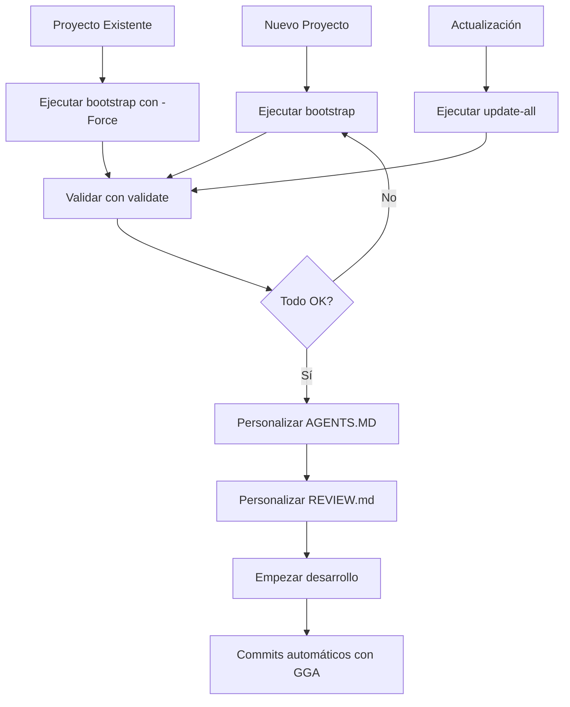

# 📁 Índice de Scripts de Automatización

## 📖 Descripción General

Este directorio contiene todos los scripts necesarios para automatizar la configuración de GGA (Guardian Anget) y SpecKit en cualquier repositorio.

## 🗂 Archivos y su Propósito

### 🚀 Scripts Principales de Instalación

| Archivo | Descripción | Cuándo usar |
|---------|-------------|-------------|
| **[bootstrap.ps1](bootstrap.ps1)** | Script maestro de automatización para Windows | Setup completo en Windows |
| **[bootstrap.sh](bootstrap.sh)** | Script maestro de automatización para Linux/macOS | Setup completo en Unix |
| **[quick-setup.ps1](quick-setup.ps1)** | Instalación rápida con un comando (Windows) | Setup rápido desde URL |
| **[quick-setup.sh](quick-setup.sh)** | Instalación rápida con un comando (Linux/macOS) | Setup rápido desde URL |

### 📋 Configuración y Templates

| Archivo | Descripción | Cuándo usar |
|---------|-------------|-------------|
| **[AGENTS.MD](AGENTS.MD)** | Directivas de comportamiento para AI agents | Personalizar para tu stack |
| **[REVIEW.md](REVIEW.md)** | Checklist de code review | Adaptar criterios del equipo |
| **[CONSTITUTION.md](CONSTITUTION.md)** | Reglas arquitectónicas del proyecto | Definir estándares de arquitectura |
| **[bootstrap.config.example.ps1](bootstrap.config.example.ps1)** | Configuración personalizable (Windows) | Crear configs custom |
| **[bootstrap.config.example.sh](bootstrap.config.example.sh)** | Configuración personalizable (Unix) | Crear configs custom |

### ✅ Validación y Mantenimiento

| Archivo | Descripción | Cuándo usar |
|---------|-------------|-------------|
| **[validate.ps1](validate.ps1)** | Verifica que el setup fue exitoso (Windows) | Después del bootstrap |
| **[validate.sh](validate.sh)** | Verifica que el setup fue exitoso (Unix) | Después del bootstrap |
| **[update-all.ps1](update-all.ps1)** | Actualiza múltiples repos a la vez (Windows) | Actualizar fleet completa |
| **[update-all.sh](update-all.sh)** | Actualiza múltiples repos a la vez (Unix) | Actualizar fleet completa |

### 📚 Documentación

| Archivo | Descripción | Para quién |
|---------|-------------|-----------|
| **[README.md](README.md)** | Guía principal de uso | Todos los usuarios |
| **[WORKFLOW.md](WORKFLOW.md)** | Workflows completos y ejemplos | Devs y team leads |
| **[INDEX.md](INDEX.md)** | Este archivo | Navegación rápida |

### 🔧 Scripts Legacy (Mantener por compatibilidad)

| Archivo | Descripción | Estado |
|---------|-------------|--------|
| **[setup-copilot.ps1](setup-copilot.ps1)** | Script anterior de setup (Windows) | ⚠️ Deprecado - Usar bootstrap.ps1 |
| **[setup-copilot.sh](setup-copilot.sh)** | Script anterior de setup (Unix) | ⚠️ Deprecado - Usar bootstrap.sh |

## 🎯 Guía de Uso Rápido

### Escenario 1: Primera vez - Setup completo

```powershell
# Windows
cd gga-copilot\auto
.\bootstrap.ps1

# Linux/macOS
cd gga-copilot/auto
./bootstrap.sh
```

**Qué hace:**
- ✅ Instala GGA, SpecKit, Copilot API
- ✅ Configura el repo actual
- ✅ Instala VS Code extensions
- ✅ Crea estructura de directorios

### Escenario 2: Configurar otro repositorio

```powershell
# Windows
.\bootstrap.ps1 C:\ruta\al\otro-proyecto

# Linux/macOS
./bootstrap.sh /ruta/al/otro-proyecto
```

### Escenario 3: Validar configuración

```powershell
# Windows
.\validate.ps1

# Linux/macOS
./validate.sh
```

### Escenario 4: Actualizar múltiples proyectos

```powershell
# Windows
.\update-all.ps1 -Repositories 'C:\repo1','C:\repo2','C:\repo3'

# Linux/macOS
./update-all.sh /home/user/repo1 /home/user/repo2 /home/user/repo3
```

### Escenario 5: Setup rápido desde internet

```powershell
# Windows
irm https://tu-url/quick-setup.ps1 | iex

# Linux/macOS
curl -sSL https://tu-url/quick-setup.sh | bash
```

## 🔧 Opciones Comunes

### bootstrap.ps1 / bootstrap.sh

```powershell
# Opciones principales
-SkipCopilotApi / --skip-copilot-api    # No instalar Copilot API
-SkipSpecKit / --skip-speckit           # No instalar SpecKit
-SkipGGA / --skip-gga                   # No instalar GGA
-SkipVSCode / --skip-vscode             # No instalar extensiones
-Force / --force                         # Sobrescribir configs existentes
```

### validate.ps1 / validate.sh

```powershell
# Validar específico
.\validate.ps1 C:\ruta\al\proyecto
./validate.sh /ruta/al/proyecto
```

### update-all.ps1 / update-all.sh

```powershell
# Opciones
-DryRun / --dry-run                      # Ver qué se haría sin ejecutar
-Force / --force                         # Forzar actualización
-UpdateToolsOnly / --update-tools-only   # Solo actualizar herramientas
-UpdateConfigsOnly / --update-configs-only  # Solo actualizar configs
```

## 📊 Workflow Recomendado



## 🎓 Orden de Lectura Recomendado

Para nuevos usuarios:

1. **[README.md](README.md)** - Empezar aquí
2. **Ejecutar bootstrap** - Instalación práctica
3. **[AGENTS.MD](AGENTS.MD)** - Entender las directivas del AI
4. **[REVIEW.md](REVIEW.md)** - Conocer el checklist
5. **[WORKFLOW.md](WORKFLOW.md)** - Workflows completos

Para team leads:

1. **[README.md](README.md)** - Overview
2. **[WORKFLOW.md](WORKFLOW.md)** - Todos los escenarios
3. **[bootstrap.config.example.ps1](bootstrap.config.example.ps1)** - Personalización
4. **Personalizar AGENTS.MD, REVIEW.md, CONSTITUTION.md**
5. **Crear script de update-all para el equipo**

## 🔄 Mantenimiento

### Actualizar scripts en todos los proyectos

```powershell
# 1. Actualizar gga-copilot (este repo)
cd gga-copilot
git pull

# 2. Actualizar todos los proyectos
cd auto
.\update-all.ps1 -Repositories @('C:\proyecto1', 'C:\proyecto2')
```

### Agregar nuevo archivo de configuración

1. Crear el archivo en `auto/`
2. Agregar a `$Config.ConfigFiles` en `bootstrap.ps1`
3. Agregar a `CONFIG_FILES_CONFIG` en `bootstrap.sh`
4. Ejecutar `update-all` en proyectos existentes

### Deprecar un script

1. Agregar ⚠️ al inicio del script
2. Actualizar este INDEX.md
3. Mantener por 6 meses antes de eliminar

## 🆘 Troubleshooting

### "bootstrap.ps1 no se ejecuta"

```powershell
# Permitir ejecución de scripts
Set-ExecutionPolicy -ExecutionPolicy RemoteSigned -Scope CurrentUser

# O ejecutar con bypass
PowerShell.exe -ExecutionPolicy Bypass -File bootstrap.ps1
```

### "Permission denied en bash"

```bash
# Hacer ejecutable
chmod +x *.sh

# Ejecutar
./bootstrap.sh
```

### "Git is not installed"

Ver [README.md - Troubleshooting](README.md#-troubleshooting)

### Scripts no encuentran archivos

```powershell
# Asegurarse de ejecutar desde el directorio auto/
cd gga-copilot\auto

# Verificar contenido
ls
```

## 📝 Contribuir

Para agregar funcionalidad:

1. Crear script en este directorio
2. Actualizar este INDEX.md
3. Agregar sección en README.md
4. Agregar ejemplo en WORKFLOW.md
5. Probar en proyecto limpio
6. Commit y PR

## 🔗 Links Útiles

- [README Principal del GGA](../README.md)
- [SpecKit en GitHub](https://github.com/github/spec-kit)
- [Copilot API](https://github.com/Yoizen/copilot-api)

## 📞 Soporte

- **Issues**: [GitHub Issues](https://github.com/tu-org/gga-copilot/issues)
- **Docs**: Este directorio
- **Ejemplos**: Ver [WORKFLOW.md](WORKFLOW.md)

---

**Última actualización**: 2026-01-03  
**Versión**: 1.0.0
